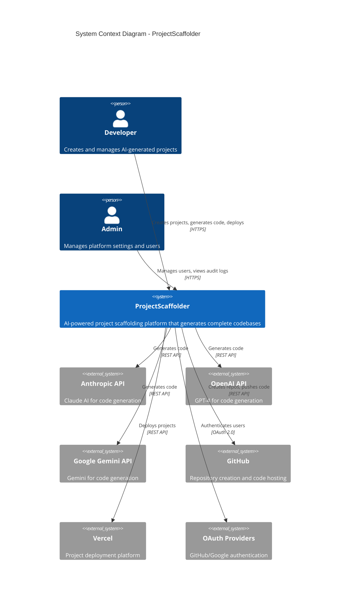

# System Context (C4 Level 1)

## Overview

The System Context diagram shows ProjectScaffolder as a black box, highlighting its relationships with users and external systems.

## System Context Diagram



## User Personas

### Developer (Primary User)
- **Goals**: Quickly scaffold new projects with AI assistance
- **Tasks**:
  - Create project definitions with tech stack
  - Generate code using AI providers
  - Deploy projects to production
  - Manage project versions and updates
- **Access Level**: Own projects only

### Admin
- **Goals**: Oversee platform usage and ensure compliance
- **Tasks**:
  - View all projects (read-only for non-owned)
  - Access audit logs
  - Manage user accounts
  - Configure platform settings
- **Access Level**: Full platform visibility

### Enterprise Admin
- **Goals**: Enterprise governance and compliance
- **Tasks**:
  - All admin capabilities
  - GDPR data subject request processing
  - Compliance reporting
  - API key management
- **Access Level**: Full administrative control

## External Systems

### AI Providers (Code Generation)

| System | Purpose | Integration |
|--------|---------|-------------|
| **Anthropic Claude** | Primary AI code generation | REST API via @anthropic-ai/sdk |
| **OpenAI GPT-4** | Alternative code generation | REST API via openai SDK |
| **Google Gemini** | Alternative code generation | REST API via @google/generative-ai |

**Characteristics**:
- Stateless request/response
- Token-based authentication
- Rate limiting applied
- Usage tracked per generation

### GitHub (Version Control)

| Capability | Purpose |
|------------|---------|
| Repository Creation | Automated repo setup for generated projects |
| Code Push | Git push of generated files |
| Authentication | OAuth provider for user sign-in |

**Integration**: Octokit REST API with Personal Access Token

### Vercel (Deployment)

| Capability | Purpose |
|------------|---------|
| Project Creation | Initialize deployment target |
| Code Deployment | Build and deploy generated code |
| Environment Variables | Secure configuration management |

**Integration**: REST API with Bearer token authentication

### OAuth Providers (Authentication)

| Provider | Purpose |
|----------|---------|
| GitHub OAuth | Developer authentication |
| Google OAuth | Alternative authentication |

**Integration**: NextAuth.js OAuth flow

## System Boundaries

### What's Inside ProjectScaffolder

- User interface (dashboard, project management)
- API layer (REST endpoints)
- Business logic (code generation, deployment orchestration)
- Data persistence (projects, users, audit logs)
- Authentication/authorization

### What's Outside (External Dependencies)

- AI model inference (Anthropic, OpenAI, Google)
- Git hosting (GitHub)
- Deployment infrastructure (Vercel)
- Identity providers (GitHub, Google OAuth)

## Communication Patterns

### Synchronous (Request/Response)

| From | To | Protocol | Purpose |
|------|-----|----------|---------|
| Browser | ProjectScaffolder | HTTPS | UI interactions |
| ProjectScaffolder | AI Providers | HTTPS | Code generation |
| ProjectScaffolder | GitHub | HTTPS | Repo management |
| ProjectScaffolder | Vercel | HTTPS | Deployment |

### Asynchronous (Polling)

| Process | Pattern | Interval |
|---------|---------|----------|
| Deployment Status | Polling | 5 seconds |
| Generation Progress | Status updates | Real-time via status field |

## Data Flow Summary

```
User Request
    ↓
ProjectScaffolder (Auth + Validation)
    ↓
┌─────────────────────────────────────┐
│         Core Processing             │
│  ┌─────────────────────────────┐   │
│  │ Projects → Generations →    │   │
│  │ Deployments                 │   │
│  └─────────────────────────────┘   │
│              ↓                      │
│    PostgreSQL (Persistence)         │
└─────────────────────────────────────┘
    ↓
External Services (AI, GitHub, Vercel)
    ↓
User Response
```

## Quality Attributes at System Level

| Attribute | Requirement | Implementation |
|-----------|-------------|----------------|
| **Availability** | 99.9% uptime | Vercel edge network |
| **Latency** | <500ms API response | Edge functions, connection pooling |
| **Throughput** | 1000 req/min | Serverless scaling |
| **Security** | SOC 2 compliant | Audit logging, encryption |
| **Privacy** | GDPR compliant | DSAR support, consent tracking |
