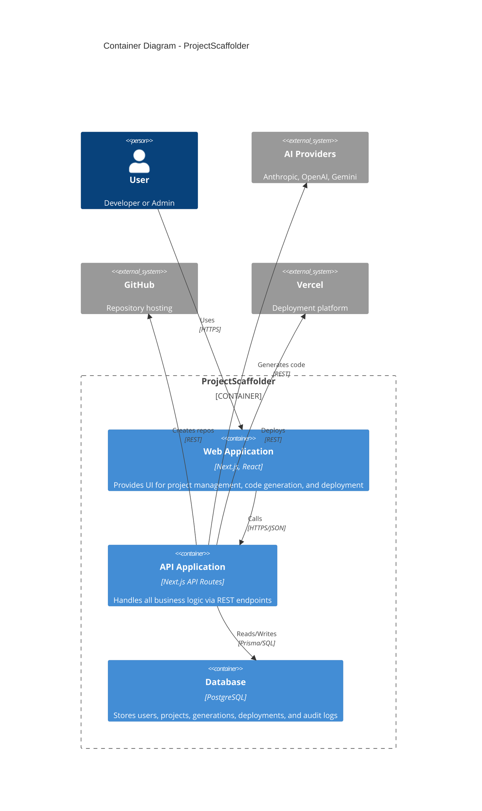
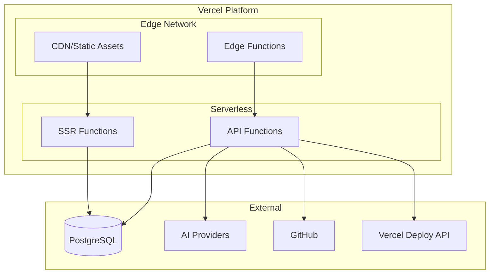

# Container Architecture (C4 Level 2)

## Overview

The Container diagram shows the high-level shape of the software architecture and how responsibilities are distributed. In our context, "containers" represent separately deployable/runnable units.

## Container Diagram



## Containers

### 1. Web Application (Frontend)

**Technology**: Next.js 16, React 19, Tailwind CSS, Radix UI

**Responsibilities**:
- Server-side rendered pages for SEO and performance
- Client-side interactivity for forms and dashboards
- Session management via NextAuth
- Theme support (light/dark mode)

**Key Routes**:
| Route | Type | Purpose |
|-------|------|---------|
| `/` | Static | Landing page |
| `/auth/signin` | Static | Authentication page |
| `/dashboard` | Dynamic | User dashboard with project list |
| `/dashboard/projects/new` | Dynamic | Project creation form |
| `/dashboard/projects/[id]` | Dynamic | Project detail view |

**Client-Side State**:
- Session state (NextAuth SessionProvider)
- Theme state (next-themes)
- Form state (React useState)

### 2. API Application (Backend)

**Technology**: Next.js API Routes, TypeScript, Zod

**Responsibilities**:
- RESTful API endpoints
- Request validation and sanitization
- Authentication and authorization
- Business logic orchestration
- External service integration

**API Endpoints**:

| Endpoint | Methods | Purpose |
|----------|---------|---------|
| `/api/auth/[...nextauth]` | GET, POST | Authentication flows |
| `/api/projects` | GET, POST | List and create projects |
| `/api/projects/[id]` | GET, PATCH, DELETE | Single project operations |
| `/api/generate` | GET, POST | Code generation |
| `/api/deploy` | GET, POST, OPTIONS | Deployment operations |

**Request Processing Flow**:
```
Request → Validation (Zod) → Auth Check → Business Logic → DB → Response
                                    ↓
                            Audit Logging
```

### 3. Database (PostgreSQL)

**Technology**: PostgreSQL, Prisma ORM 7

**Responsibilities**:
- Persistent data storage
- Relational data integrity
- Query optimization via indexes
- Connection pooling

**Schema Organization**:
| Domain | Tables |
|--------|--------|
| Identity | User, Account, Session, VerificationToken |
| Projects | Project, CodeGeneration, Deployment |
| Compliance | AuditLog, DataSubjectRequest, ConsentRecord |
| Security | ApiKey |

**Connection Management**:
- Prisma Client singleton pattern
- pg Pool for connection pooling
- Lazy initialization in serverless context

## Container Interactions

### Frontend ↔ API

```typescript
// Example: Project creation flow
const response = await fetch('/api/projects', {
  method: 'POST',
  headers: { 'Content-Type': 'application/json' },
  body: JSON.stringify({
    name: 'My Project',
    techStack: [{ name: 'Next.js', category: 'frontend' }],
    description: 'A new project'
  })
});
```

**Communication Pattern**: JSON over HTTPS
**Authentication**: JWT via cookies (NextAuth)

### API ↔ Database

```typescript
// Example: Prisma query
const project = await db.project.create({
  data: {
    name,
    description,
    techStack,
    status: 'DRAFT',
    ownerId: session.user.id,
  }
});
```

**ORM**: Prisma with type-safe queries
**Connection**: pg adapter with pooling

### API ↔ External Services

**AI Providers**:
```typescript
const provider = getLLMProvider('anthropic');
const result = await provider.generate(prompt, { maxTokens: 4096 });
```

**GitHub**:
```typescript
const github = new GitHubService();
await github.createRepository({ name, description, isPrivate: true });
await github.pushFiles({ owner, repo }, { files, commitMessage });
```

**Vercel**:
```typescript
const vercel = new VercelService();
const project = await vercel.createProject(name);
const deployment = await vercel.deploy(projectId, files);
```

## Deployment View



## Scalability Characteristics

| Container | Scaling Model | Bottleneck |
|-----------|---------------|------------|
| Web App | Horizontal (serverless) | None (stateless) |
| API | Horizontal (serverless) | Database connections |
| Database | Vertical + Read replicas | Connection limits |

## Security Boundaries

```
┌─────────────────────────────────────────────────┐
│                   DMZ (Public)                  │
│  ┌─────────────────────────────────────────┐   │
│  │     Web Application (Static + SSR)       │   │
│  │         ↓ Session Cookie                 │   │
│  │     API Routes (Authenticated)           │   │
│  └─────────────────────────────────────────┘   │
└─────────────────────────────────────────────────┘
                      ↓ Encrypted Connection
┌─────────────────────────────────────────────────┐
│              Private Network                    │
│  ┌─────────────────────────────────────────┐   │
│  │         PostgreSQL Database              │   │
│  │    (No public access, SSL required)      │   │
│  └─────────────────────────────────────────┘   │
└─────────────────────────────────────────────────┘
```

## Technology Choices

| Concern | Choice | Rationale |
|---------|--------|-----------|
| Frontend Framework | Next.js | SSR, API routes, Vercel integration |
| UI Components | Radix UI | Accessible, unstyled primitives |
| Styling | Tailwind CSS | Utility-first, design system |
| ORM | Prisma | Type safety, migrations, tooling |
| Validation | Zod | Runtime validation, TypeScript integration |
| Auth | NextAuth.js | OAuth support, session management |
