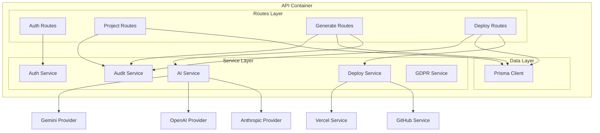
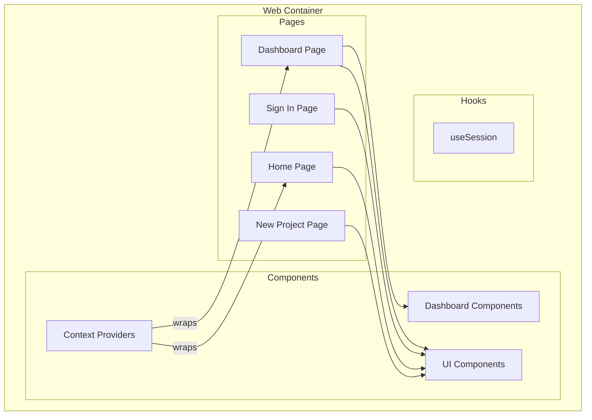

# Component Architecture (C4 Level 3)

## Overview

The Component diagram shows the internal structure of each container, detailing the components and their interactions.

## API Container Components



## Component Details

### Routes Layer (`src/app/api/`)

#### Auth Routes (`/api/auth/[...nextauth]`)

```typescript
// Location: src/app/api/auth/[...nextauth]/route.ts
export { GET, POST } from "@/lib/auth/config";
```

**Responsibilities**:
- OAuth callback handling
- Session management
- JWT token operations

#### Project Routes (`/api/projects`)

```typescript
// Location: src/app/api/projects/route.ts
// Location: src/app/api/projects/[id]/route.ts

// Endpoints:
GET  /api/projects          // List projects (paginated)
POST /api/projects          // Create project
GET  /api/projects/[id]     // Get single project
PATCH /api/projects/[id]    // Update project
DELETE /api/projects/[id]   // Delete project
```

**Input Validation**:
```typescript
const createProjectSchema = z.object({
  name: z.string().min(1).max(100),
  description: z.string().max(1000).optional(),
  techStack: z.array(z.object({
    name: z.string(),
    category: z.enum(["frontend", "backend", "database", "devops", "other"]),
  })),
  prompt: z.string().max(10000).optional(),
});
```

#### Generate Routes (`/api/generate`)

```typescript
// Location: src/app/api/generate/route.ts

// Endpoints:
POST /api/generate              // Trigger code generation
GET  /api/generate?projectId=x  // Get generation history
```

**Flow**:
1. Validate request body
2. Verify project ownership
3. Update project status to GENERATING
4. Create CodeGeneration record
5. Call AI provider with prompt
6. Parse response for files
7. Update records with results
8. Log audit event

#### Deploy Routes (`/api/deploy`)

```typescript
// Location: src/app/api/deploy/route.ts

// Endpoints:
POST    /api/deploy              // Trigger deployment
GET     /api/deploy?projectId=x  // Get deployment history
OPTIONS /api/deploy/providers    // List configured providers
```

---

### Service Layer (`src/lib/`)

#### Auth Service (`src/lib/auth/`)

**Files**:
- `config.ts` - NextAuth configuration
- `session.ts` - Session utilities

**Key Functions**:
```typescript
// Session utilities
getSession(): Promise<Session | null>
getCurrentUser(): Promise<SessionUser | null>
requireAuth(): Promise<SessionUser>
requireRole(roles: Role | Role[]): Promise<SessionUser>
hasRole(user: SessionUser | null, roles: Role | Role[]): boolean
isAdmin(user: SessionUser | null): boolean
```

**Providers Configuration**:
```typescript
providers: [
  GitHubProvider({...}),
  GoogleProvider({...}),
  CredentialsProvider({...}),
]
```

#### AI Service (`src/lib/ai/`)

**Files**:
- `index.ts` - Factory and utilities
- `types.ts` - Type definitions
- `anthropic.ts` - Claude provider
- `openai.ts` - GPT provider
- `gemini.ts` - Gemini provider

**Interface**:
```typescript
interface LLMProviderInterface {
  name: string;
  isConfigured(): boolean;
  generate(prompt: string, options?: GenerateOptions): Promise<GenerateResult>;
  generateChat(messages: LLMMessage[], options?: GenerateOptions): Promise<GenerateResult>;
}
```

**Factory Pattern**:
```typescript
// Get specific provider
const provider = getLLMProvider('anthropic');

// Get default provider
const defaultProvider = getDefaultProvider();

// Get available providers
const providers = getConfiguredProviders();
```

**Code Generation**:
```typescript
// Create prompt from project description
const prompt = createCodeGenerationPrompt(
  projectDescription,
  techStack,
  additionalInstructions
);

// Generate code
const result = await generate(prompt, { provider: 'anthropic' });

// Parse response
const files = parseCodeGenerationResponse(result.content);
```

#### Deploy Service (`src/lib/deploy/`)

**Files**:
- `index.ts` - Orchestration
- `github.ts` - GitHub integration
- `vercel.ts` - Vercel integration

**GitHub Service**:
```typescript
class GitHubService {
  getAuthenticatedUser(): Promise<User>
  repoExists(owner: string, repo: string): Promise<boolean>
  createRepository(options: CreateRepoOptions): Promise<Repository>
  pushFiles(repo: RepoIdentifier, options: PushOptions): Promise<PushResult>
}
```

**Vercel Service**:
```typescript
class VercelService {
  listProjects(): Promise<Project[]>
  getProject(idOrName: string): Promise<Project>
  createProject(name: string, options?: CreateOptions): Promise<Project>
  setEnvVariables(projectId: string, envVars: Record<string, string>): Promise<void>
  createDeployment(projectId: string, files: File[]): Promise<Deployment>
  getDeployment(deploymentId: string): Promise<Deployment>
  waitForDeployment(deploymentId: string, timeout?: number): Promise<Deployment>
}
```

**Deployment Pipeline**:
```typescript
async function fullDeploymentPipeline(options: PipelineOptions) {
  // 1. Create GitHub repo
  const githubResult = await createAndPushToGitHub({...});

  // 2. Deploy to provider
  const deployResult = await deploy({
    provider: options.deployProvider,
    projectName: options.projectName,
    files: options.files,
  });

  return { githubUrl, deploymentUrl };
}
```

#### Audit Service (`src/lib/compliance/audit.ts`)

**Functions**:
```typescript
// Core audit function
async function createAuditLog(options: AuditLogOptions): Promise<void>

// Convenience methods
audit.create(userId, resource, resourceId, details)
audit.read(userId, resource, resourceId, details)
audit.update(userId, resource, resourceId, details)
audit.delete(userId, resource, resourceId, details)
audit.error(userId, resource, action, errorMessage, details)
audit.security(userId, action, details, severity)

// Query functions
getAuditLogs(filters: AuditFilters): Promise<PaginatedResult>
exportAuditLogs(filters: AuditFilters, format: 'json' | 'csv'): Promise<string>
```

**Audit Log Entry**:
```typescript
{
  userId: string | null,
  action: 'CREATE' | 'READ' | 'UPDATE' | 'DELETE' | 'LOGIN' | 'LOGOUT' | 'ERROR',
  resource: 'User' | 'Project' | 'CodeGeneration' | 'Deployment',
  resourceId: string | null,
  oldValue: object | null,
  newValue: object | null,
  details: object | null,
  ipAddress: string | null,
  userAgent: string | null,
  requestId: string | null,
  severity: 'DEBUG' | 'INFO' | 'WARNING' | 'ERROR' | 'CRITICAL',
  category: string | null,
}
```

#### GDPR Service (`src/lib/compliance/gdpr.ts`)

**Functions**:
```typescript
// Data Subject Requests
createDataSubjectRequest(email: string, requestType: DSRType): Promise<DSR>
verifyDataSubjectRequest(token: string): Promise<DSR>
processAccessRequest(dsrId: string): Promise<UserData>
processDeleteRequest(dsrId: string): Promise<void>

// Consent Management
recordConsent(options: ConsentOptions): Promise<void>
revokeConsent(email: string, purpose: string): Promise<void>
getConsentStatus(email: string): Promise<ConsentStatus>
```

---

### Data Layer (`src/lib/db/`)

**Prisma Client Singleton**:
```typescript
// src/lib/db/index.ts
import { PrismaClient } from "@prisma/client";
import { PrismaPg } from "@prisma/adapter-pg";
import { Pool } from "pg";

const prismaClientSingleton = () => {
  const pool = new Pool({ connectionString: process.env.DATABASE_URL });
  const adapter = new PrismaPg(pool);
  return new PrismaClient({ adapter });
};

export const db = globalThis.prisma ?? prismaClientSingleton();
```

---

## Web Application Components



### Pages

| Page | Path | Type | Purpose |
|------|------|------|---------|
| Home | `/` | Static | Landing page with features |
| Sign In | `/auth/signin` | Static | Authentication form |
| Dashboard | `/dashboard` | Dynamic (SSR) | Project list and stats |
| New Project | `/dashboard/projects/new` | Dynamic | Project creation form |

### UI Components (`src/components/ui/`)

| Component | File | Purpose |
|-----------|------|---------|
| Button | `button.tsx` | Primary action buttons with variants |
| Card | `card.tsx` | Content container with header/content/footer |
| Input | `input.tsx` | Form input field |
| Badge | `badge.tsx` | Status indicators |

### Dashboard Components (`src/components/dashboard/`)

| Component | File | Purpose |
|-----------|------|---------|
| Navbar | `navbar.tsx` | Navigation and user menu |
| ProjectCard | `project-card.tsx` | Project summary card |

### Providers (`src/components/providers.tsx`)

```typescript
export function Providers({ children }: ProvidersProps) {
  return (
    <SessionProvider>
      {children}
    </SessionProvider>
  );
}
```

---

## Type Definitions (`src/types/`)

**Key Types**:
```typescript
// Auth
type Role = 'USER' | 'ADMIN' | 'ENTERPRISE_ADMIN';
interface SessionUser { id, email, name?, image?, role }

// Projects
type ProjectStatus = 'DRAFT' | 'GENERATING' | 'GENERATED' | 'DEPLOYING' | 'DEPLOYED' | 'FAILED';
interface TechStackItem { name, category, version? }

// AI
type LLMProvider = 'anthropic' | 'openai' | 'gemini';
interface GenerateOptions { maxTokens?, temperature?, systemPrompt? }
interface GenerateResult { content, model, usage, finishReason }

// Deployment
type DeploymentProvider = 'vercel' | 'netlify' | 'github-pages';
interface DeploymentConfig { provider, projectName, envVariables?, buildCommand?, outputDirectory? }
interface DeploymentResult { success, url?, error? }

// Audit
type AuditSeverity = 'DEBUG' | 'INFO' | 'WARNING' | 'ERROR' | 'CRITICAL';
interface AuditLogEntry { action, resource, resourceId?, details?, severity, category? }
```

---

## Component Dependencies

```
Routes
  └── Services (Auth, AI, Deploy, Audit)
        └── External SDKs (Anthropic, OpenAI, Octokit)
        └── Database Client (Prisma)
              └── PostgreSQL

UI Components
  └── Radix UI Primitives
  └── Tailwind CSS
  └── Lucide Icons
```
