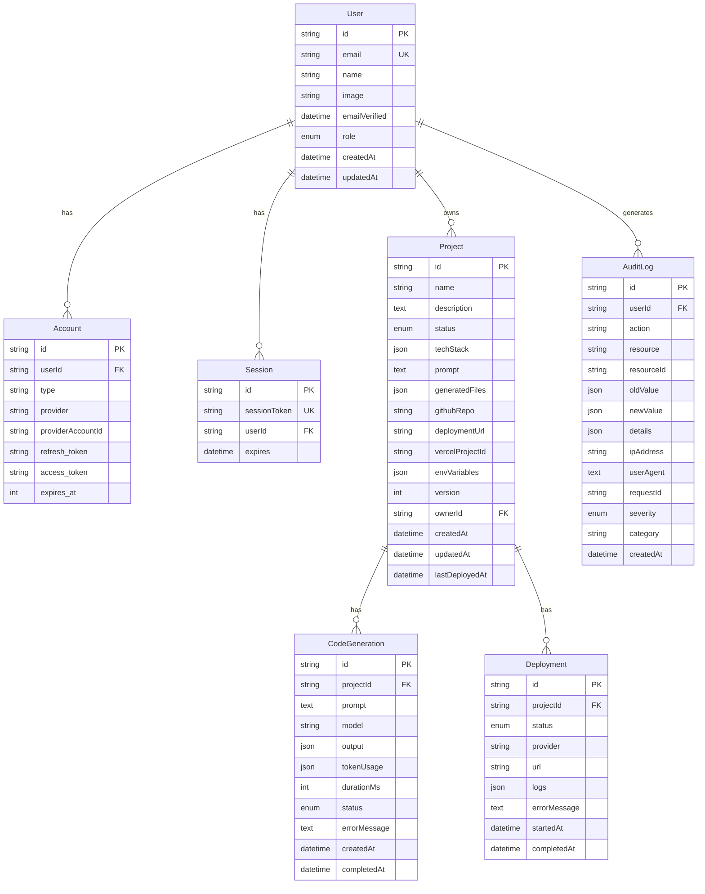
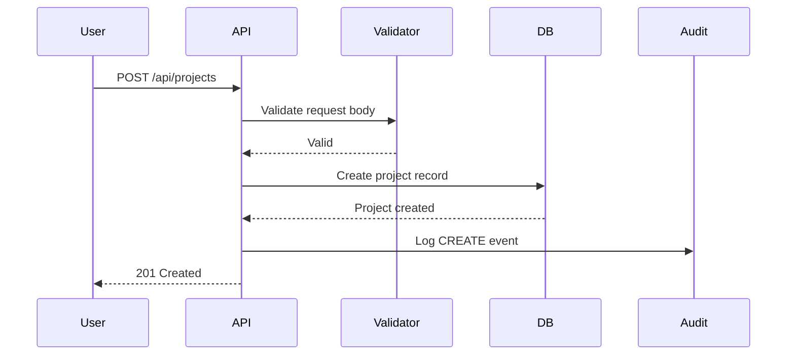
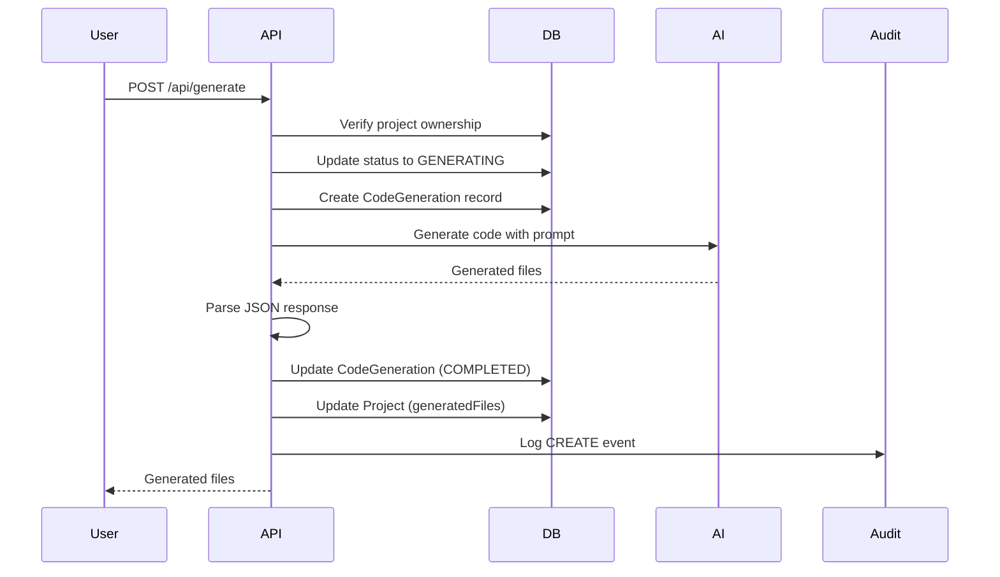
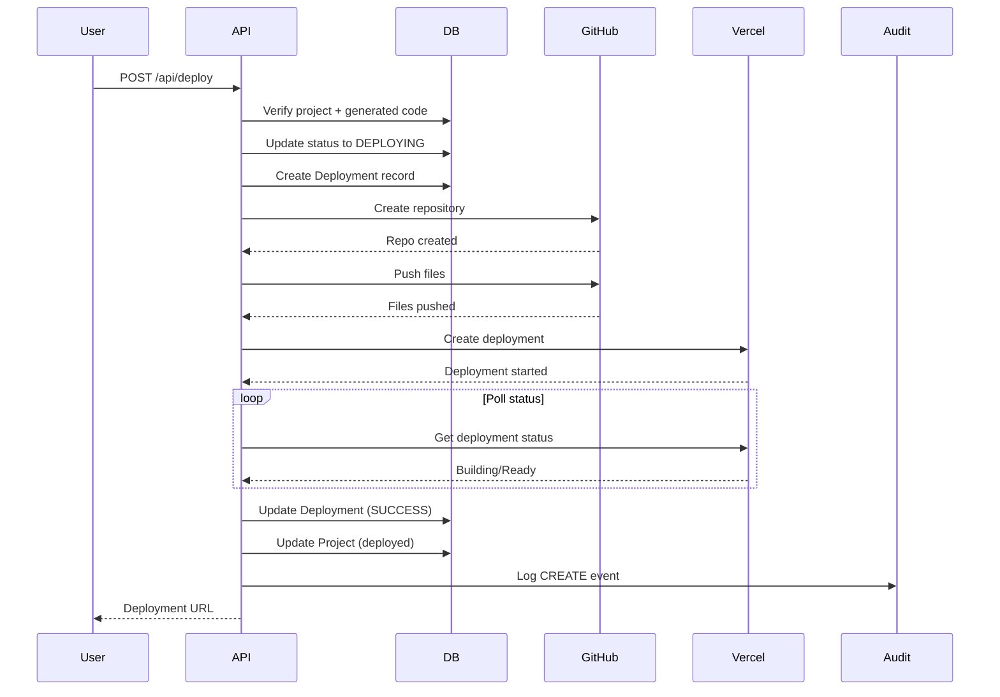

# Data Architecture

## Overview

This document describes the data models, storage strategies, and data flow patterns used in ProjectScaffolder.

## Entity Relationship Diagram



## Domain Models

### Identity Domain

#### User
The central identity entity representing a registered user.

| Field | Type | Constraints | Description |
|-------|------|-------------|-------------|
| id | cuid | PK | Unique identifier |
| email | string | UNIQUE | User's email address |
| name | string? | - | Display name |
| image | string? | - | Profile image URL |
| emailVerified | datetime? | - | Email verification timestamp |
| role | enum | DEFAULT(USER) | USER, ADMIN, ENTERPRISE_ADMIN |
| createdAt | datetime | DEFAULT(now) | Account creation time |
| updatedAt | datetime | @updatedAt | Last update time |

#### Account
OAuth provider account linkage.

| Field | Type | Description |
|-------|------|-------------|
| id | cuid | Unique identifier |
| userId | string | Foreign key to User |
| type | string | Account type (oauth, email, etc.) |
| provider | string | Provider name (github, google) |
| providerAccountId | string | Provider's user ID |
| refresh_token | text? | OAuth refresh token |
| access_token | text? | OAuth access token |
| expires_at | int? | Token expiration timestamp |

**Unique Constraint**: (provider, providerAccountId)

#### Session
Active user sessions.

| Field | Type | Description |
|-------|------|-------------|
| id | cuid | Unique identifier |
| sessionToken | string | Unique session token |
| userId | string | Foreign key to User |
| expires | datetime | Session expiration time |

### Project Domain

#### Project
Core entity representing a scaffolded project.

| Field | Type | Description |
|-------|------|-------------|
| id | cuid | Unique identifier |
| name | string | Project name |
| description | text? | Project description |
| status | enum | Current project status |
| techStack | json | Array of technology selections |
| prompt | text? | User's detailed requirements |
| generatedFiles | json? | Generated file structure |
| githubRepo | string? | GitHub repository URL |
| deploymentUrl | string? | Live deployment URL |
| vercelProjectId | string? | Vercel project identifier |
| envVariables | json? | Encrypted environment variables |
| version | int | Project version (increments on regeneration) |
| ownerId | string | Foreign key to User |
| lastDeployedAt | datetime? | Last deployment timestamp |

**Status Values**:
- `DRAFT` - Initial state, not yet generated
- `GENERATING` - Code generation in progress
- `GENERATED` - Code successfully generated
- `DEPLOYING` - Deployment in progress
- `DEPLOYED` - Successfully deployed
- `FAILED` - Generation or deployment failed

**techStack Schema**:
```json
[
  { "name": "Next.js", "category": "frontend", "version": "14" },
  { "name": "PostgreSQL", "category": "database" },
  { "name": "Prisma", "category": "database", "version": "5" }
]
```

**generatedFiles Schema**:
```json
[
  { "path": "package.json", "content": "..." },
  { "path": "src/index.ts", "content": "..." }
]
```

#### CodeGeneration
Record of each code generation attempt.

| Field | Type | Description |
|-------|------|-------------|
| id | cuid | Unique identifier |
| projectId | string | Foreign key to Project |
| prompt | text | The prompt sent to LLM |
| model | string | Model used (claude-3, gpt-4, etc.) |
| output | json? | Generated files array |
| tokenUsage | json? | Input/output token counts |
| durationMs | int? | Generation duration |
| status | enum | PENDING, PROCESSING, COMPLETED, FAILED |
| errorMessage | text? | Error details if failed |

**tokenUsage Schema**:
```json
{ "inputTokens": 1500, "outputTokens": 8000 }
```

#### Deployment
Record of deployment attempts.

| Field | Type | Description |
|-------|------|-------------|
| id | cuid | Unique identifier |
| projectId | string | Foreign key to Project |
| status | enum | PENDING, BUILDING, SUCCESS, FAILED, CANCELLED |
| provider | string | Deployment provider (vercel, netlify) |
| url | string? | Deployed URL if successful |
| logs | json? | Deployment logs |
| errorMessage | text? | Error details if failed |
| startedAt | datetime | Deployment start time |
| completedAt | datetime? | Deployment completion time |

### Compliance Domain

#### AuditLog
Comprehensive audit trail for all operations.

| Field | Type | Description |
|-------|------|-------------|
| id | cuid | Unique identifier |
| userId | string? | User who performed action (null for system) |
| action | string | Action type (CREATE, READ, UPDATE, DELETE, LOGIN) |
| resource | string | Resource type (User, Project, etc.) |
| resourceId | string? | Specific resource ID |
| oldValue | json? | Previous state (for updates) |
| newValue | json? | New state (for creates/updates) |
| details | json? | Additional context |
| ipAddress | string? | Client IP address |
| userAgent | text? | Client user agent |
| requestId | string? | Request correlation ID |
| severity | enum | DEBUG, INFO, WARNING, ERROR, CRITICAL |
| category | string? | Category (authentication, data_access, etc.) |

#### DataSubjectRequest
GDPR data subject request tracking.

| Field | Type | Description |
|-------|------|-------------|
| id | cuid | Unique identifier |
| email | string | Requester's email |
| requestType | enum | ACCESS, DELETION, RECTIFICATION, PORTABILITY, OBJECTION |
| status | enum | PENDING, VERIFIED, PROCESSING, COMPLETED, REJECTED |
| verificationToken | string? | Email verification token |
| verifiedAt | datetime? | Verification timestamp |
| processedBy | string? | Admin who processed |
| processedAt | datetime? | Processing timestamp |
| notes | text? | Processing notes |

#### ConsentRecord
User consent tracking for GDPR.

| Field | Type | Description |
|-------|------|-------------|
| id | cuid | Unique identifier |
| userId | string? | User ID if authenticated |
| email | string | User's email |
| purpose | string | Consent purpose (marketing, analytics) |
| granted | boolean | Consent granted/denied |
| method | string | Collection method (checkbox, banner) |
| ipAddress | string? | Client IP |
| userAgent | text? | Client user agent |
| revokedAt | datetime? | Revocation timestamp |

#### ApiKey
API key management for programmatic access.

| Field | Type | Description |
|-------|------|-------------|
| id | cuid | Unique identifier |
| name | string | Key name/description |
| keyHash | string | Hashed API key (never store plain) |
| keyPrefix | string | First 8 chars for identification |
| userId | string | Key owner |
| scopes | string[] | Allowed operations |
| lastUsedAt | datetime? | Last usage timestamp |
| usageCount | int | Total usage count |
| expiresAt | datetime? | Expiration time |
| revokedAt | datetime? | Revocation time |

## Database Indexes

```sql
-- User indexes
CREATE INDEX idx_user_email ON "User" (email);

-- Project indexes
CREATE INDEX idx_project_owner ON "Project" (ownerId);
CREATE INDEX idx_project_status ON "Project" (status);
CREATE INDEX idx_project_created ON "Project" (createdAt);

-- CodeGeneration indexes
CREATE INDEX idx_codegen_project ON "CodeGeneration" (projectId);
CREATE INDEX idx_codegen_status ON "CodeGeneration" (status);
CREATE INDEX idx_codegen_created ON "CodeGeneration" (createdAt);

-- Deployment indexes
CREATE INDEX idx_deployment_project ON "Deployment" (projectId);
CREATE INDEX idx_deployment_status ON "Deployment" (status);

-- AuditLog indexes
CREATE INDEX idx_audit_user ON "AuditLog" (userId);
CREATE INDEX idx_audit_action ON "AuditLog" (action);
CREATE INDEX idx_audit_resource ON "AuditLog" (resource);
CREATE INDEX idx_audit_created ON "AuditLog" (createdAt);
CREATE INDEX idx_audit_severity ON "AuditLog" (severity);

-- ApiKey indexes
CREATE INDEX idx_apikey_hash ON "ApiKey" (keyHash);
CREATE INDEX idx_apikey_user ON "ApiKey" (userId);
```

## Data Flow Diagrams

### Project Creation Flow



### Code Generation Flow



### Deployment Flow



## Data Retention

| Data Type | Retention Period | Deletion Policy |
|-----------|-----------------|-----------------|
| User accounts | Indefinite | On user request (GDPR) |
| Projects | Indefinite | On user deletion (cascade) |
| Code generations | Indefinite | On project deletion |
| Deployments | Indefinite | On project deletion |
| Audit logs | 7 years | Anonymization on user deletion |
| Sessions | 30 days | Auto-expire |
| API keys | Until revoked | Manual revocation |

## Data Encryption

### At Rest
- Database: Managed PostgreSQL encryption
- Environment variables: Application-layer encryption before storage

### In Transit
- All connections: TLS 1.2+
- Database connection: SSL required

### Sensitive Fields
| Field | Protection |
|-------|------------|
| User.email | Stored plain (indexed) |
| Account.access_token | OAuth provider encrypted |
| Account.refresh_token | OAuth provider encrypted |
| Project.envVariables | Application encryption |
| ApiKey.keyHash | One-way hash (bcrypt) |
| DataSubjectRequest.verificationToken | One-way hash |

## Backup Strategy

| Component | Frequency | Retention |
|-----------|-----------|-----------|
| Database | Daily | 30 days |
| Transaction logs | Continuous | 7 days |
| Point-in-time recovery | Available | 7 days |
