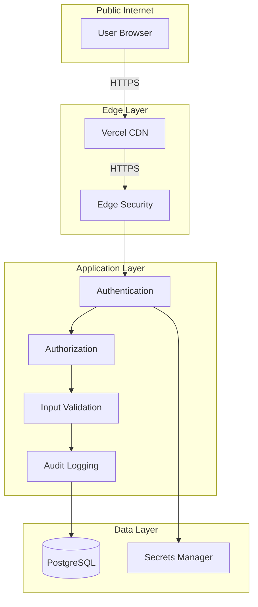
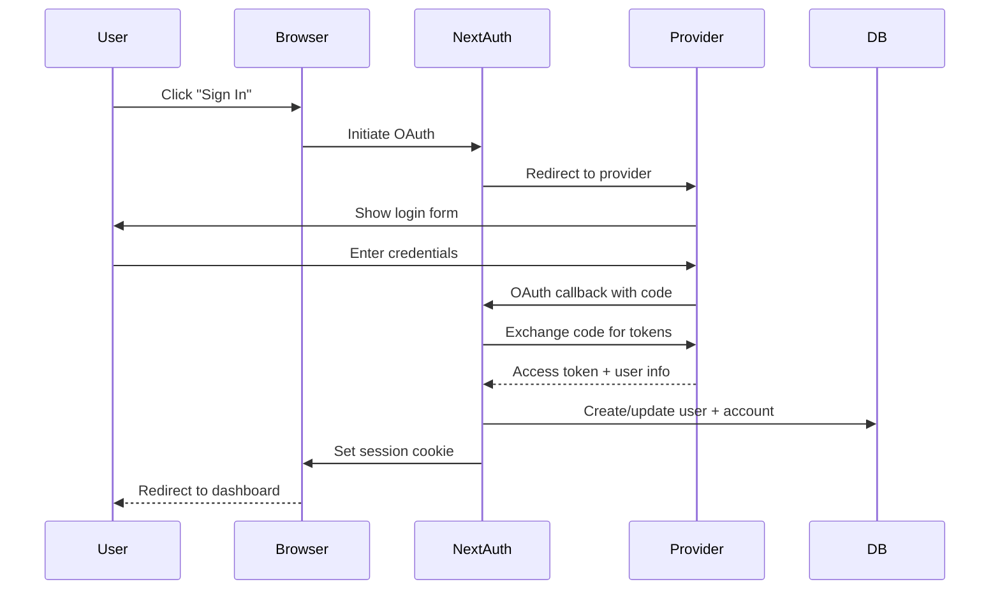
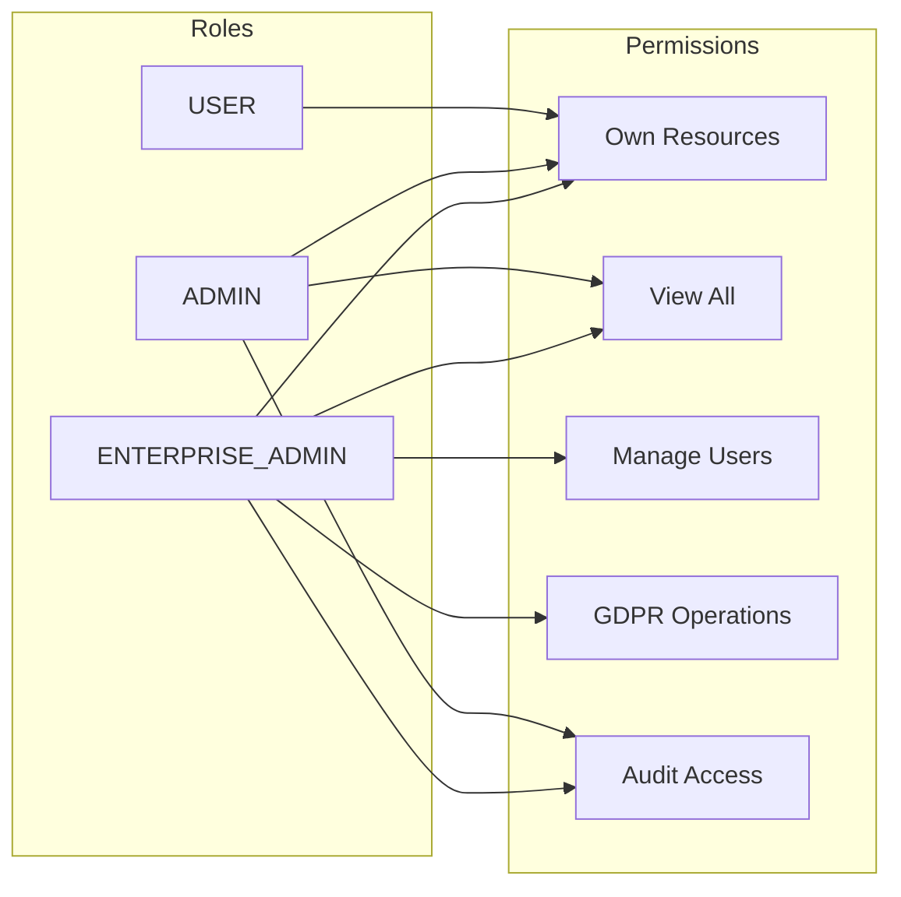
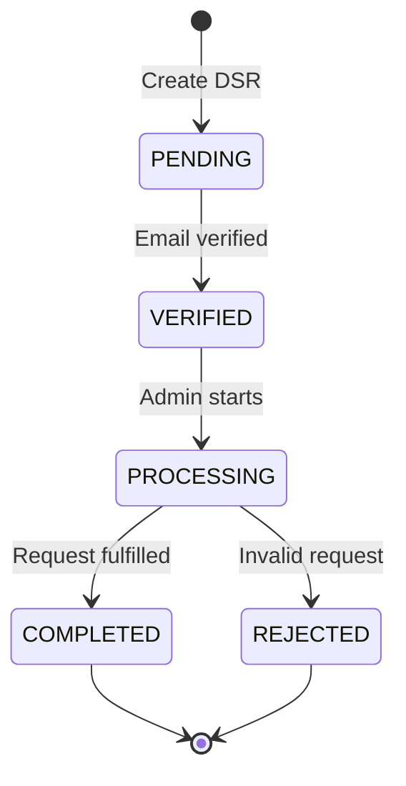

# Security Architecture

## Overview

This document describes the security controls, authentication mechanisms, authorization patterns, and compliance features implemented in ProjectScaffolder.

## Security Architecture Diagram



## Authentication

### Authentication Flow



### Authentication Providers

| Provider | Type | Configuration |
|----------|------|---------------|
| GitHub | OAuth 2.0 | Client ID + Secret |
| Google | OAuth 2.0 | Client ID + Secret |
| Credentials | Email/Password | Custom validation |

### Session Management

```typescript
// NextAuth configuration
{
  session: {
    strategy: "jwt",
    maxAge: 30 * 24 * 60 * 60, // 30 days
  },
  jwt: {
    secret: process.env.NEXTAUTH_SECRET,
  },
}
```

**Session Token**:
- JWT-based tokens
- Stored in HTTP-only cookies
- Contains: userId, email, role, name
- Signed with NEXTAUTH_SECRET

### Multi-Factor Authentication (Future)

Currently not implemented. Planned for enterprise tier:
- TOTP (authenticator apps)
- WebAuthn (hardware keys)
- SMS backup codes

## Authorization

### Role-Based Access Control (RBAC)



### Permission Matrix

| Action | USER | ADMIN | ENTERPRISE_ADMIN |
|--------|------|-------|------------------|
| Create own projects | Yes | Yes | Yes |
| View own projects | Yes | Yes | Yes |
| Edit own projects | Yes | Yes | Yes |
| Delete own projects | Yes | Yes | Yes |
| View all projects | No | Read-only | Read-only |
| View audit logs | No | Yes | Yes |
| Manage users | No | No | Yes |
| Process GDPR requests | No | No | Yes |
| Manage API keys | Own | Own | All |

### Authorization Checks

```typescript
// Session verification
const session = await getServerSession(authOptions);
if (!session?.user) {
  return NextResponse.json({ error: "Unauthorized" }, { status: 401 });
}

// Ownership verification
if (project.ownerId !== session.user.id && session.user.role === "USER") {
  return NextResponse.json({ error: "Forbidden" }, { status: 403 });
}

// Role-based check
const user = await requireRole(["ADMIN", "ENTERPRISE_ADMIN"]);
```

## Input Validation

### Validation Strategy

All API inputs are validated using Zod schemas:

```typescript
const createProjectSchema = z.object({
  name: z.string()
    .min(1, "Name is required")
    .max(100, "Name too long"),
  description: z.string()
    .max(1000, "Description too long")
    .optional(),
  techStack: z.array(
    z.object({
      name: z.string(),
      category: z.enum(["frontend", "backend", "database", "devops", "other"]),
    })
  ).min(1, "At least one technology required"),
});
```

### Validation Error Response

```json
{
  "error": "Invalid request body",
  "details": [
    {
      "path": ["name"],
      "message": "Name is required"
    }
  ]
}
```

### SQL Injection Prevention

Prisma ORM provides parameterized queries:

```typescript
// Safe - parameterized
const project = await db.project.findUnique({
  where: { id: projectId }
});

// Never use raw queries with user input
// db.$queryRaw is avoided
```

### XSS Prevention

- React automatically escapes output
- Content-Security-Policy headers via Helmet
- No `dangerouslySetInnerHTML` usage

## Security Headers

### Helmet.js Configuration

```typescript
import helmet from "helmet";

// Applied headers:
// - Content-Security-Policy
// - X-Content-Type-Options: nosniff
// - X-Frame-Options: DENY
// - X-XSS-Protection: 1; mode=block
// - Strict-Transport-Security
// - Referrer-Policy: strict-origin-when-cross-origin
```

### Content Security Policy

```
default-src 'self';
script-src 'self' 'unsafe-inline' 'unsafe-eval';
style-src 'self' 'unsafe-inline';
img-src 'self' data: https:;
font-src 'self';
connect-src 'self' https://api.anthropic.com https://api.openai.com;
```

## Secrets Management

### Environment Variables

| Secret | Purpose | Rotation |
|--------|---------|----------|
| DATABASE_URL | Database connection | On compromise |
| NEXTAUTH_SECRET | JWT signing | Annually |
| ANTHROPIC_API_KEY | AI provider | On compromise |
| OPENAI_API_KEY | AI provider | On compromise |
| GOOGLE_AI_API_KEY | AI provider | On compromise |
| GITHUB_TOKEN | Repository access | 90 days |
| VERCEL_TOKEN | Deployment | 90 days |

### Secret Storage

- Development: `.env` file (gitignored)
- Production: Vercel environment variables
- Never committed to version control

## Audit Logging

### Logged Events

| Category | Events |
|----------|--------|
| Authentication | LOGIN, LOGOUT, LOGIN_FAILED |
| Data Access | CREATE, READ, UPDATE, DELETE |
| Security | PERMISSION_DENIED, API_KEY_CREATED |
| System | ERROR, DEPLOYMENT_STARTED |

### Audit Log Entry

```typescript
{
  userId: "clx...",
  action: "CREATE",
  resource: "Project",
  resourceId: "clx...",
  details: { name: "My Project" },
  ipAddress: "192.168.1.1",
  userAgent: "Mozilla/5.0...",
  requestId: "req-123",
  severity: "INFO",
  category: "data_access",
  createdAt: "2024-01-15T10:30:00Z"
}
```

### Audit Retention

- Retention: 7 years (compliance requirement)
- Anonymization: On user deletion (GDPR)
- Export: JSON/CSV for compliance reporting

## GDPR Compliance

### Data Subject Rights

| Right | Implementation |
|-------|----------------|
| Access | Export all user data as JSON |
| Deletion | Cascade delete + audit anonymization |
| Rectification | Update user profile |
| Portability | Download data in portable format |
| Objection | Consent revocation |

### Data Subject Request Flow



### Consent Management

```typescript
// Record consent
await recordConsent({
  email: user.email,
  purpose: "marketing",
  granted: true,
  method: "checkbox",
});

// Check consent
const status = await getConsentStatus(user.email);
if (!status.marketing) {
  // Don't send marketing emails
}
```

## SOC 2 Type II Controls

### Trust Service Criteria

| Criteria | Control | Implementation |
|----------|---------|----------------|
| **Security** | Access Control | RBAC + session management |
| **Security** | Encryption | TLS + data at rest |
| **Security** | Monitoring | Audit logging |
| **Availability** | Uptime | Vercel edge network |
| **Processing Integrity** | Validation | Zod input validation |
| **Confidentiality** | Data Protection | Encryption + access control |
| **Privacy** | Consent | GDPR compliance |

### Control Evidence

| Control | Evidence |
|---------|----------|
| Authentication required | Session check on protected routes |
| Authorization enforced | Ownership/role checks |
| Input validated | Zod schema validation |
| Actions logged | Audit log entries |
| Data encrypted | TLS + database encryption |

## Rate Limiting

### Configuration

```typescript
import { RateLimiterMemory } from "rate-limiter-flexible";

const rateLimiter = new RateLimiterMemory({
  points: 100,      // requests
  duration: 60,     // per minute
});
```

### Limits by Endpoint

| Endpoint | Limit | Window |
|----------|-------|--------|
| `/api/projects` | 100/min | Per user |
| `/api/generate` | 10/min | Per user |
| `/api/deploy` | 5/min | Per user |
| `/api/auth/*` | 20/min | Per IP |

## Threat Model

### STRIDE Analysis

| Threat | Mitigation |
|--------|------------|
| **Spoofing** | OAuth authentication, session tokens |
| **Tampering** | Input validation, HTTPS, database constraints |
| **Repudiation** | Comprehensive audit logging |
| **Information Disclosure** | RBAC, encryption, CSP headers |
| **Denial of Service** | Rate limiting, CDN caching |
| **Elevation of Privilege** | Role checks, ownership verification |

### Attack Surface

| Surface | Protection |
|---------|------------|
| Web UI | CSP, XSS prevention, CSRF tokens |
| API | Authentication, authorization, validation |
| Database | Parameterized queries, connection encryption |
| External APIs | API key rotation, scoped permissions |

## Incident Response

### Security Event Classification

| Severity | Examples | Response Time |
|----------|----------|---------------|
| Critical | Data breach, system compromise | Immediate |
| High | Authentication bypass attempt | 1 hour |
| Medium | Rate limit exceeded | 4 hours |
| Low | Invalid login attempts | 24 hours |

### Response Procedures

1. **Detect**: Audit log monitoring
2. **Contain**: Revoke compromised credentials
3. **Investigate**: Analyze audit logs
4. **Remediate**: Patch vulnerabilities
5. **Recover**: Restore from backups
6. **Learn**: Update security controls

## Security Checklist

- [x] Authentication required for protected routes
- [x] Authorization checks on all endpoints
- [x] Input validation with Zod
- [x] SQL injection prevention (Prisma ORM)
- [x] XSS prevention (React + CSP)
- [x] HTTPS enforced
- [x] Security headers (Helmet)
- [x] Audit logging
- [x] Rate limiting
- [x] GDPR compliance
- [x] Secrets not in code
- [ ] Penetration testing
- [ ] Bug bounty program
- [ ] SOC 2 certification
