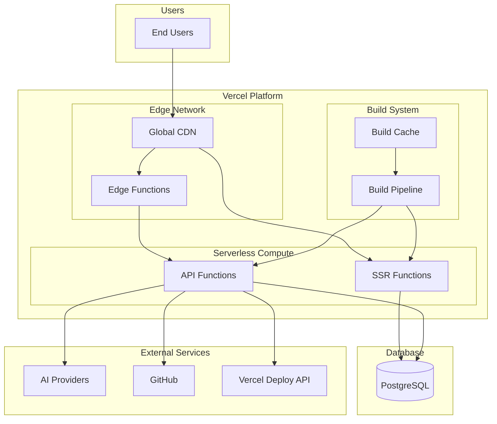
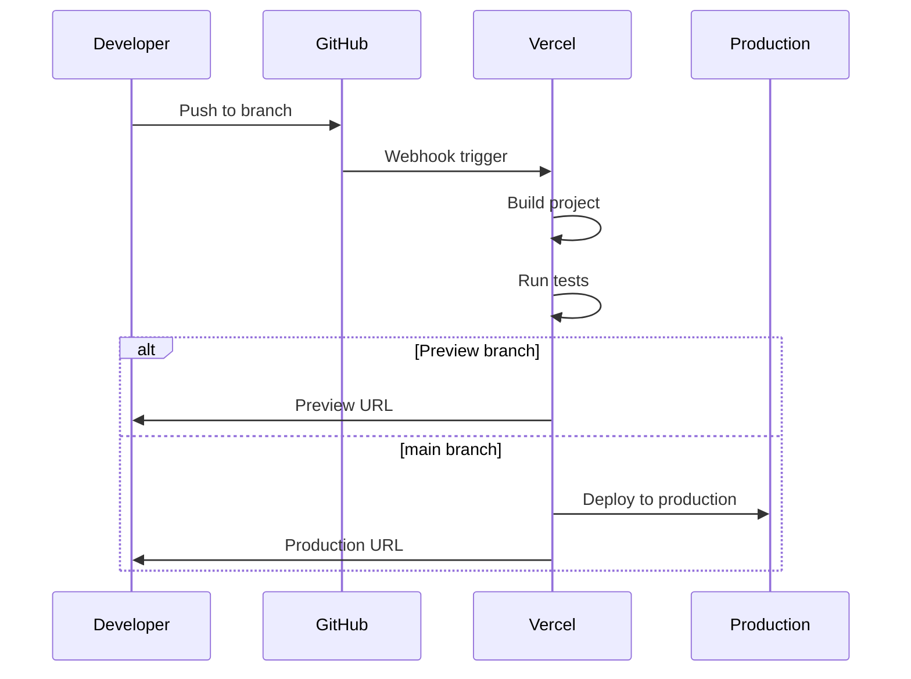
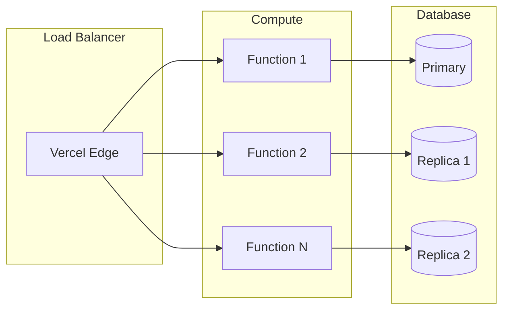

# Deployment Architecture

## Overview

This document describes the infrastructure, deployment pipeline, and operational aspects of ProjectScaffolder.

## Infrastructure Diagram



## Deployment Strategy

### Environment Tiers

| Environment | Branch | URL | Purpose |
|-------------|--------|-----|---------|
| Production | `main` | projectscaffolder.com | Live users |
| Preview | PR branches | *.vercel.app | PR review |
| Development | Local | localhost:3000 | Development |

### Deployment Flow



## CI/CD Pipeline

### GitHub Actions Workflow

```yaml
# .github/workflows/ci.yml
name: CI/CD

on:
  push:
    branches: [main]
  pull_request:
    branches: [main]

jobs:
  lint:
    runs-on: ubuntu-latest
    steps:
      - uses: actions/checkout@v4
      - uses: actions/setup-node@v4
        with:
          node-version: '20'
          cache: 'npm'
      - run: npm ci
      - run: npm run lint

  typecheck:
    runs-on: ubuntu-latest
    steps:
      - uses: actions/checkout@v4
      - uses: actions/setup-node@v4
        with:
          node-version: '20'
          cache: 'npm'
      - run: npm ci
      - run: npx tsc --noEmit

  test:
    runs-on: ubuntu-latest
    steps:
      - uses: actions/checkout@v4
      - uses: actions/setup-node@v4
        with:
          node-version: '20'
          cache: 'npm'
      - run: npm ci
      - run: npm test

  security:
    runs-on: ubuntu-latest
    steps:
      - uses: actions/checkout@v4
      - run: npm audit --audit-level=high

  build:
    needs: [lint, typecheck, test, security]
    runs-on: ubuntu-latest
    steps:
      - uses: actions/checkout@v4
      - uses: actions/setup-node@v4
        with:
          node-version: '20'
          cache: 'npm'
      - run: npm ci
      - run: npm run build
```

### Pipeline Stages

| Stage | Purpose | Failure Action |
|-------|---------|----------------|
| Lint | Code style enforcement | Block merge |
| Typecheck | TypeScript validation | Block merge |
| Test | Unit/integration tests | Block merge |
| Security | Vulnerability scan | Block merge |
| Build | Production build test | Block merge |
| Deploy | Vercel deployment | Alert team |

## Vercel Configuration

### Project Settings

```json
// vercel.json
{
  "framework": "nextjs",
  "buildCommand": "npm run build",
  "devCommand": "npm run dev",
  "installCommand": "npm ci",
  "regions": ["iad1", "sfo1", "fra1"],
  "functions": {
    "api/**/*.ts": {
      "memory": 1024,
      "maxDuration": 30
    }
  }
}
```

### Environment Variables

| Variable | Environment | Encrypted |
|----------|-------------|-----------|
| DATABASE_URL | All | Yes |
| NEXTAUTH_SECRET | All | Yes |
| NEXTAUTH_URL | Per environment | No |
| ANTHROPIC_API_KEY | All | Yes |
| OPENAI_API_KEY | All | Yes |
| GITHUB_TOKEN | All | Yes |
| VERCEL_TOKEN | All | Yes |

### Function Configuration

| Function | Memory | Timeout | Region |
|----------|--------|---------|--------|
| API routes | 1024 MB | 30s | Edge |
| SSR pages | 1024 MB | 10s | Edge |
| Code generation | 1024 MB | 60s | Specific |

## Database Deployment

### PostgreSQL Configuration

**Provider Options**:
- Vercel Postgres
- Neon
- Supabase
- Railway
- AWS RDS

**Connection Pooling**:
```typescript
const pool = new Pool({
  connectionString: process.env.DATABASE_URL,
  max: 10,
  idleTimeoutMillis: 30000,
  connectionTimeoutMillis: 2000,
});
```

### Migration Strategy

```bash
# Development: push schema changes
npx prisma db push

# Production: use migrations
npx prisma migrate dev --name description
npx prisma migrate deploy
```

### Backup Strategy

| Backup Type | Frequency | Retention |
|-------------|-----------|-----------|
| Full backup | Daily | 30 days |
| Transaction log | Continuous | 7 days |
| Point-in-time | Available | 7 days |

## Scaling Architecture

### Horizontal Scaling



### Scaling Triggers

| Metric | Threshold | Action |
|--------|-----------|--------|
| Concurrent requests | Auto | Add function instances |
| Database connections | 80% | Scale connection pool |
| Memory usage | 90% | Alert + scale |
| Response time | >2s | Alert |

## Monitoring & Observability

### Metrics Collection

| Metric | Source | Dashboard |
|--------|--------|-----------|
| Request count | Vercel Analytics | Vercel |
| Response time | Vercel Analytics | Vercel |
| Error rate | Vercel Logs | Custom |
| Database queries | Prisma Metrics | Custom |

### Logging Strategy

```typescript
// Structured logging
console.log(JSON.stringify({
  level: 'info',
  message: 'Project created',
  projectId: project.id,
  userId: session.user.id,
  timestamp: new Date().toISOString(),
}));
```

### Alerting Rules

| Alert | Condition | Severity | Action |
|-------|-----------|----------|--------|
| High error rate | >5% errors | Critical | Page on-call |
| Slow response | p95 > 2s | Warning | Slack notification |
| Database down | Connection failed | Critical | Page on-call |
| Deployment failed | Build error | High | Slack notification |

## Disaster Recovery

### Recovery Point Objective (RPO)

| Data Type | RPO | Mechanism |
|-----------|-----|-----------|
| Database | 1 hour | Point-in-time recovery |
| User uploads | 24 hours | Daily backup |
| Configuration | Real-time | Version control |

### Recovery Time Objective (RTO)

| Scenario | RTO | Procedure |
|----------|-----|-----------|
| Function failure | Instant | Auto-retry |
| Region failure | 5 min | Multi-region failover |
| Database failure | 30 min | Restore from backup |
| Full disaster | 4 hours | Full restore procedure |

### Failover Procedure

1. Detect failure (automated monitoring)
2. Route traffic to healthy region
3. Restore database from backup
4. Verify data integrity
5. Resume normal operations
6. Post-incident review

## Cost Optimization

### Resource Allocation

| Resource | Development | Production |
|----------|-------------|------------|
| Function memory | 512 MB | 1024 MB |
| Database tier | Free | Pro |
| Build minutes | 6000/mo | Unlimited |
| Bandwidth | 100 GB | 1 TB |

### Cost Monitoring

- Set up Vercel spending limits
- Monitor function execution time
- Optimize database queries
- Use caching where appropriate

## Security in Deployment

### Secret Rotation

| Secret | Rotation Period | Procedure |
|--------|-----------------|-----------|
| API keys | 90 days | Manual in Vercel |
| Database password | 90 days | Coordinate with provider |
| NEXTAUTH_SECRET | Annually | Coordinate session invalidation |

### Access Control

| Role | Vercel Access | GitHub Access |
|------|---------------|---------------|
| Developer | View deployments | Push to branches |
| Lead | Configure settings | Merge to main |
| Admin | Full access | Admin access |

## Deployment Checklist

### Pre-Deployment

- [ ] All tests passing
- [ ] No security vulnerabilities
- [ ] Database migrations ready
- [ ] Environment variables updated
- [ ] Documentation updated

### Post-Deployment

- [ ] Verify deployment health
- [ ] Check error rates
- [ ] Validate critical flows
- [ ] Monitor performance
- [ ] Update changelog

### Rollback Procedure

1. Identify issue via monitoring
2. Navigate to Vercel dashboard
3. Select previous deployment
4. Click "Promote to Production"
5. Verify rollback successful
6. Investigate and fix issue
